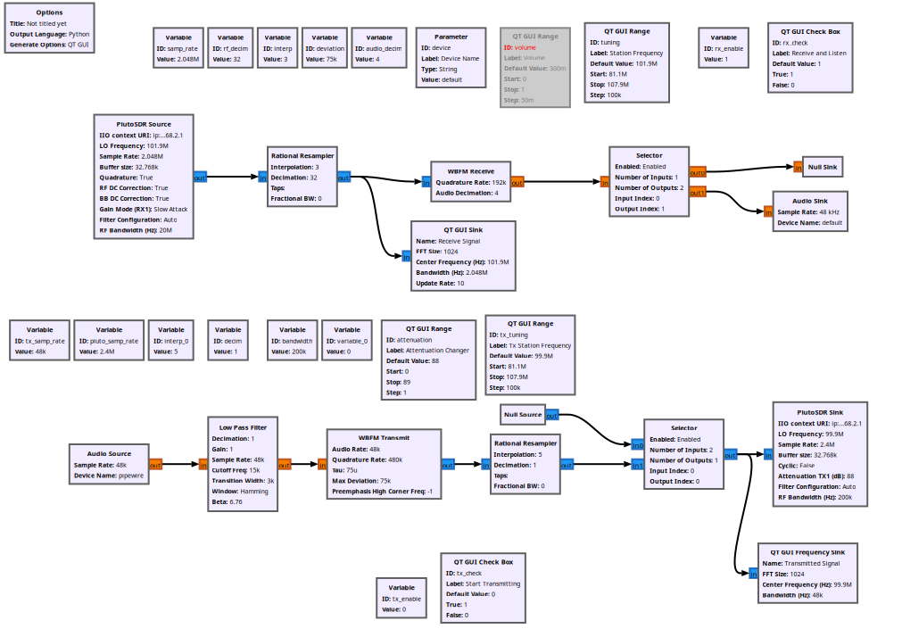

# Personal FM Station — PlutoSDR FM Scanner + Transmitter

A single GNU Radio flowgraph that turns an ADALM-Pluto into two things at once: an **FM scanner** for finding an empty spot on the dial, and a **very low power FM transmitter** that plays my computer's audio through the old analog radio in my room.

<!-- Photo: the Pluto, the antenna/coax, and the analog radio it's talking to -->

*The Pluto and the radio it's broadcasting to.*

---

<!-- Screenshot: the GRC canvas -->

*Both chains in GNU Radio Companion.Rx top, Tx bottom.*

<!-- Image: the radio -->

*Radio I use*

---

## The Pluto jailbreak

This is the fun part, and it's the reason the tuning slider goes down to 81.1 MHz.

The ADALM-Pluto is a transceiver officially good for **325 MHz to 3.8 GHz** with 20 MHz of bandwidth. The FM broadcast band is at 88–108 MHz, so the transceiver is not made for this use case (at least according to the spec sheet).

We can open up the frequency range to us through a few command line actions.

Following the walkthrough in [PySDR's PlutoSDR chapter](https://pysdr.org/content/pluto.html):

```bash
ssh root@192.168.2.1        # password: analog

fw_setenv attr_name compatible
fw_setenv attr_val ad9364

reboot
```

This opens the PlutoSDR to the range of **70 MHz to 6 GHz** and 56 MHz of bandwidth.

---

## Why scan before transmitting

Because 88–108 MHz belongs to licensed FM broadcasters. This transmission is at such a low level as not to interfere with anyone, but I also want the radio in my room to pick up my signal on a channel that is open so I can keep the gain low.

In the US, unlicensed transmitting in the FM band falls under **47 CFR §15.239**, which caps field strength at 250 µV/m measured 3 metres away. That is a *tiny* number — a small fraction of a microwatt, with a useful range of a few feet. It is legally fine to fill your own room and nowhere near enough to bother a neighbor.

Operating recommendations:

- Scan first, pick an open channel.
- Start at maximum attenuation, back off only until the radio locks
- Short scrap of wire for an antenna, or better, coax straight into the radio's antenna terminal
- Do not add an amplifier


## Running it

You'll need GNU Radio 3.10+ with `gr-iio`, `libiio`, and a Linux box with PipeWire. **Only tested on Linux the audio source will need a different config on Windows**

```bash
iio_info -u ip:192.168.2.1                  # confirm the Pluto is alive
gnuradio-companion pluto_FM_TxAndRx.grc     # then hit Run
```

To transmit computer audio rather than a microphone, route your audio sink's **monitor** output into the flowgraph using `qpwgraph` or `pavucontrol`.

---
## Credit

The firmware modification and a great deal of the Pluto explanation come from **[PySDR: A Guide to SDR and DSP using Python](https://pysdr.org)** by Dr. Marc Lichtman — specifically the [PlutoSDR chapter](https://pysdr.org/content/pluto.html). Worth reading start to finish.

Also: Analog Devices' ADALM-Pluto wiki, and the GNU Radio docs for `analog.wfm_tx` / `analog.wfm_rcv`.
